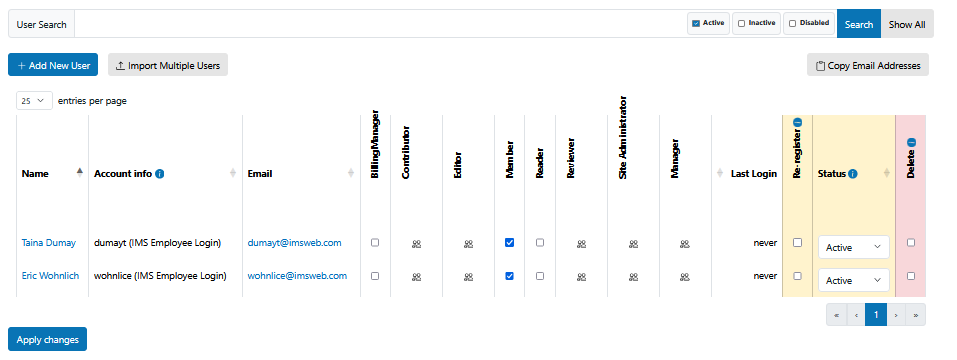

Browser Changes
================

This package overrides core Plone functionality for the User's Overview page. It includes the following features:

   Browser View @@usergroup-userprefs

* Search by activity status
* Include current status and option to activate/disable accounts in the table results
* Visual indication of non-active user rows
* IdP account info
* Replace Update Password with Re-Register checkbox.
