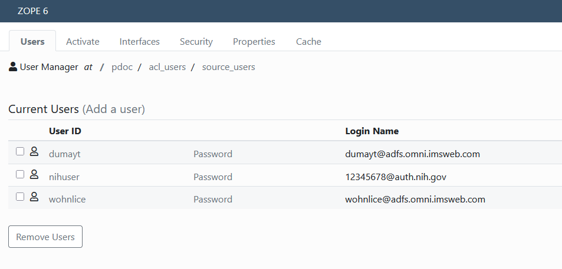

Linking accounts
=====================

The major underlying philosophy of this addon is Plone user accounts must be linked to a single Identity Provider (IdP) account via
Shibboleth headers.

PluggableAuthService has a distinction between login name and user id. It should be noted that Plone generally treats
these as identical. It is still possible to use login names in Plone, but some interface changees may be preferred for UX.

   
   Login name must be unique. Uses IdP as a namespace

Note that the IdP domain is used as a namespace for the login name. This means that the user has access to the site only
when logging in with their linked IdP. It also means that someone with the same id from *a different IdP* will *not*
get access to that user account.

Registration
------------

When adding a new user a site admin probably does not know the details of that user's IdP account, or maybe even what IdP
that user will use. This will instead be supplied by the user during the registration process. When adding a new user,
the user is sent an email (see `Email Messages <email.html>`_) with a URL to link their account. This process is
similar to the default Plone reset password behavior and in fact uses the PasswordResetTool to generate a unique key for that user.
When visiting the site from that URL they will first be directed through Shibboleth, either by the challenge plugin
or by virtue of Apache/Nginx settings. The request sends them to the  ``@@linkaccount`` view which consumes and invalidates the key 
and updates the user's login name. 

Before registration is complete, users will be given a unique, unsable login name. The domain is always ``@not.linked`` to allow
unlinked users to be easily identified.

Re-linking accounts
-------------------

Re-linking uses the same process as registration, except that the email instructions may be different. Login names
are NOT changed until the relink unique key is consumed.